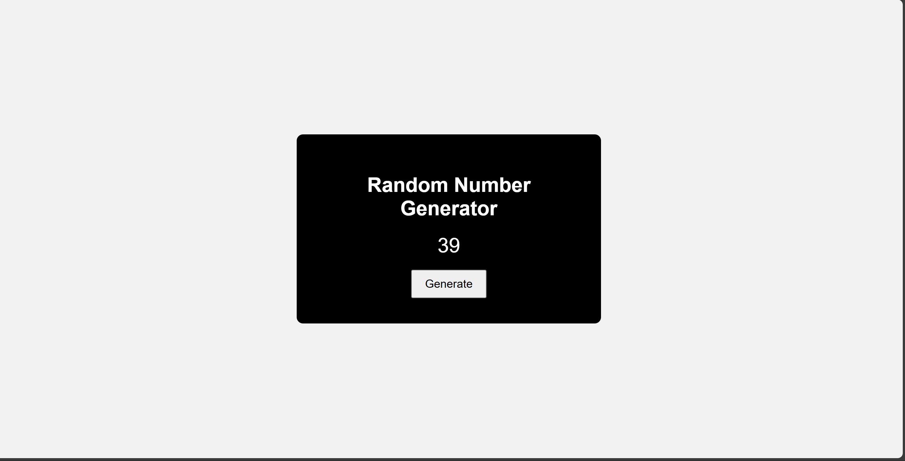
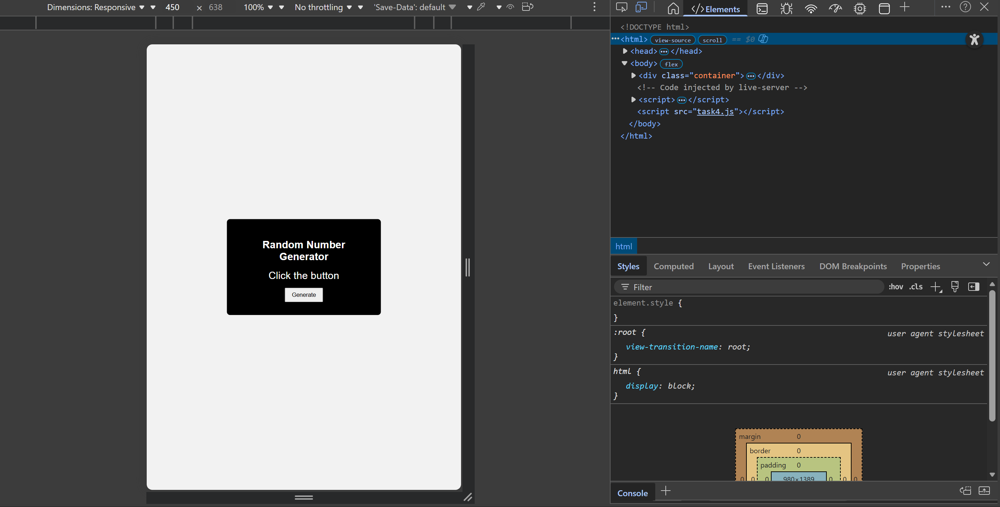

# Task 4 – Mobile-Friendly Random Number Generator

## Description

This project is a simple **Random Number Generator web page** made responsive using **CSS media queries**.
The goal of this task is to convert a desktop layout into a **mobile-friendly responsive design** that works properly on different screen sizes.

---

## Features

* Generates a **random number between 1 and 100**
* Clean **centered desktop layout**
* **Responsive mobile design** using media queries
* Scalable text, container, and button for small screens
* Tested using **Chrome DevTools mobile viewport**

---

## Technologies Used

* HTML5
* CSS3 (Media Queries, Responsive Layout)
* JavaScript
* Chrome DevTools for responsiveness testing

---

## How to Run the Project

1. Download or clone this repository
2. Open the folder in **VS Code**
3. Open **index.html** in your browser
4. Click **Generate** to see a random number
5. Use **Chrome DevTools → Mobile view** to test responsiveness

---

## Responsive Design Details

* Used **viewport meta tag** for proper mobile scaling
* Applied **@media (max-width: 768px)** for mobile screens
* Converted fixed widths to **flexible percentages**
* Reduced **font sizes and padding** for smaller devices
* Ensured **no horizontal scrolling or overflow**

---

## Screenshots

### Desktop View

### Mobile View

---

## Learning Outcome

* Understanding **media queries**
* Implementing **mobile-first responsive design**
* Using **flexible CSS units** like %, rem, and vw
* Testing layouts across **different screen sizes**
